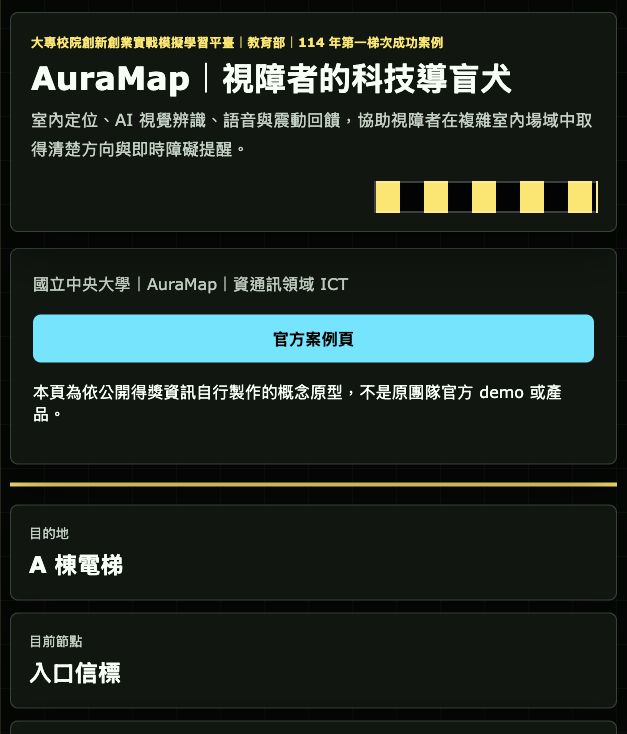
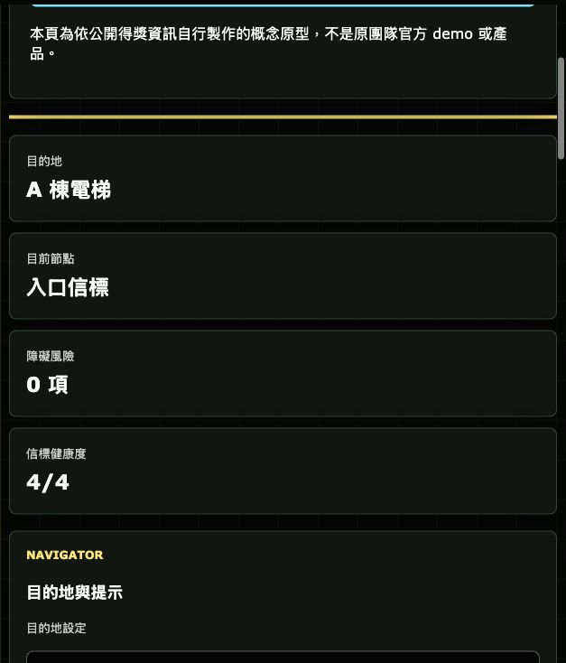

# AuraMap｜視障者的科技導盲犬 Demo

## 快速看懂

- 線上 Demo：https://atlasforcn.github.io/startup-auramap-navigation/
- 這個原型在做什麼：把 AuraMap 做成視障室內導航輔助系統，聚焦目的地、節點、障礙與語音/震動提示。
- 特色定位：特色是 accessibility-first：畫面資訊服務管理者，但流程以視障者導航安全為核心。
- 操作流程：設定室內目的地 → 依序推進路線節點與信標狀態 → 加入障礙提醒並產生語音/震動提示紀錄

展開完整功能流程截圖

這個 repo 是「AuraMap｜視障者的科技導盲犬」的互動式前端 demo，以視障者在室內場域自主導航為主要情境。Demo 使用原生 HTML、CSS、JavaScript 製作，不需要安裝建置工具。

## 比賽來源

- 平臺：大專校院創新創業實戰模擬學習平臺
- 主辦資訊：教育部
- 案例類型：成功案例
- 年度：114 年
- 屆次 / 階段：第一梯次
- 學校：國立中央大學
- 團隊 / 作品：AuraMap｜視障者的科技導盲犬
- 公司 / 團隊：AuraMap
- 領域：資通訊領域 ICT
- 官方來源：https://ssp.moe.gov.tw/cases/1486

## 核心概念

AuraMap 的核心概念是為視障者提供科技導盲犬般的室內導航輔助。系統整合室內定位、AI 視覺辨識、語音 / 震動回饋、障礙提醒與場域部署管理，讓使用者能在大樓、校園、展場或公共服務空間中取得清楚、可追蹤、可調整的導引提示。

## Demo 範圍

本 demo 模擬一個 accessibility-first 的室內導航輔助系統，涵蓋：

- 目的地設定：選擇常見室內目的地，並依目的地產生路線節點。
- 室內路線節點：以高對比平面圖呈現目前位置、下一節點、已完成節點與終點。
- 障礙物提醒：可在場域中加入臨時障礙，觸發語音與震動提示。
- 語音 / 震動提示：可開關語音與震動回饋，並用文字模擬語音指令。
- 場域信標狀態：監看入口、走廊、轉角與目的地附近的信標狀態。
- 導航事件紀錄：保留目的地變更、路線推進、障礙提醒、信標校正與語音指令紀錄。

## 免責聲明

這是依公開得獎資訊與概念自行製作的興趣原型，不是原團隊官方 demo 或產品，也不代表原團隊、學校或主辦單位立場。

## 使用方式

直接用瀏覽器開啟 `index.html`。頁面載入後可以設定目的地、啟動導航、前進到下一節點、加入障礙、模擬語音指令、切換語音 / 震動提示，以及檢視信標與事件紀錄。
